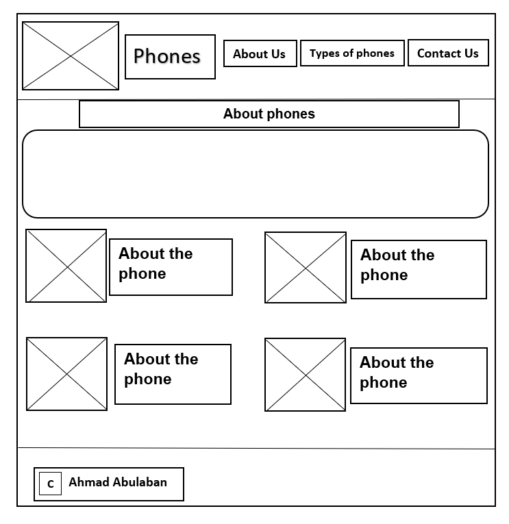

# What is wireframing?

### Wireframing is a technique for designing a website's structure. A wireframe is a diagram that shows how information and functionality on a website should be laid up, taking into consideration user demands and journeys. Early in the development process, wireframes are used to create the fundamental framework of a page before visual design and content are added.

### Example:

## In UI design, wireframing is critical

* A wireframe is a web page layout that shows what interface components will be present on important pages. It's an important step in the interface design process.

* A wireframe's purpose is to offer a visual representation of a page early in a project so that stakeholders and project team members may approve it before the creative process begins. Wireframes may also be used to build the global and secondary navigation, ensuring that the site's vocabulary and structure fit user expectations.

## Advantages of Wireframing

- Make Changes More Efficiently
* Display the Architecture of Your Site
+ Clarify Website Features before You Build Them
- Focus on the User Experience
* Make Content Development Better
+ Save Time and Money

# HTML fundamentals

### HTML (Hypertext Markup Language) is the coding that organizes a web page's structure and content. Content might be organized using paragraphs, a list of bulleted points, or pictures and data tables.

## what is HTML?

### HTML is a markup language that specifies how your material is organized. HTML is made up of a set of components that you may employ to enclose or wrap certain portions of your content to make it seem or function a specific manner. The surrounding tags can be used to make a word or picture hyperlink to another location, italicize words, change the font size, and so on.

- For example:

> `My car is beautiful`

## paragraph

**to put it in a paragraph**

> `
My car is beautiful
`

## Images

**To put a picture you must write**

> ``

## Lists

**To put a List you must write**

> `<ul>`

>  `<li>technologists</li>`

>  `<li>thinkers</li>`

>  `<li>builders</li>`

> `</ul>`

# Links

**To put a link you must write**

> `<a href="Website link">WebSite name</a>`

# Semantics

**semantics is the field concerned with the rigorous mathematical study of the meaning of programming languages. It does so by evaluating the meaning of syntactically valid strings defined by a specific programming language, showing the computation involved.**

# Semantic elements

- `<article>`
- `<aside>`
- `
`
- `<figcaption>`
- `<figure>`
- `<footer>`
- `<header>`
- `<main>`
- `<mark>`
- `<nav>`
- `<section>`
- `
`
- `<time>`

