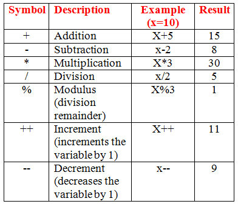

# Skim

### Expressions and operators

**An expression is any valid set of literals, variables, operators, and expressions that evaluates to a single value. The value may be a number, a string, or a logical value. Conceptually, there are two types of expressions: those that assign a value to a variable, and those that simply have a value.**

### To find out more [click here](https://ahmad-abulaban.github.io/Reading-notes/Read05)

# Functions

**A function in JavaScript is similar to a procedure—a set of statements that performs a task or calculates a value, but for a procedure to qualify as a function, it should take some input and return an output where there is some obvious relationship between the input and the output.**

## Defining functions

* Function declarations

**A function definition consists of the function keyword, followed by:**

1. The name of the function.
2. A list of parameters to the function, enclosed in parentheses and separated by commas.
3. The JavaScript statements that define the function, enclosed in curly brackets, `{...}`.

**For example:**

`function square(number) {`
>  `return number * number;`

`}`

* Function expressions

**While the function declaration above is syntactically a statement, functions can also be created by a function expression.**

**Such a function can be anonymous; it does not have to have a name. For example, the function square could have been defined as:**

`const square = function(number) { return number * number }`
`var x = square(4)`

## Calling functions

**Defining a function does not execute it. Defining it names the function and specifies what to do when the function is called.**

**Calling the function actually performs the specified actions with the indicated parameters. For example, if you define the function square, you could call it as follows:**

> `square(5);`

## Function scope

**Variables defined inside a function cannot be accessed from anywhere outside the function, because the variable is defined only in the scope of the function. However, a function can access all variables and functions defined inside the scope in which it is defined.**

`var num1 = 20, num2 = 3, name = 'Ahmad';`

`function multiply() {`

  `return num1 * num2;`

`}`

`multiply();`

## Scope and the function stack

`var foo = function bar() {`

  `// code`

`}`

## Closures

**Closures are one of the most powerful features of JavaScript. JavaScript allows for the nesting of functions and grants the inner function full access to all the variables and functions defined inside the outer function (and all other variables and functions that the outer function has access to).**

## Using the arguments object

**The arguments of a function are maintained in an array-like object. Within a function, you can address the arguments passed to it as follows:**

> `arguments[i]`

# Read

## Control flow

**The control flow is the order in which the computer executes statements in a script.**

**For example:**

`if (field==empty) {`

> `promptUser();`

`} else {`

> `submitForm();`

`}`

# Read and Demo

## JavaScript Functions:

**A JavaScript function is a block of code designed to perform a particular task.**

**Example**

`function myFunction(p1, p2) {`
>  `return p1 * p2;`

`}`

### JavaScript Functions

* JavaScript Function Syntax

**Example**

`function name(parameter1, parameter2, parameter3) {`
> `// code to be executed`
`}`

* Function Return

**Example**

`let x = myFunction(4, 3);`

`function myFunction(a, b) {`
> `return a * b;`
`}`

* Local Variables

**Example**

`function myFunction() {`

  `let carName = "Volvo";`

  `// code here CAN use carName`

`}`

# JavaScript Arithmetic Operators

| Operator	 | Description |
| --- | ----------- |
| + | Addition |
| - | Subtraction |
| * | Multiplication |
| ** | Exponentiation |
| / | Division |
| % | Modulus  |
| ++ | Increment |
| -- | Decrement  |

# Reference

- [Expressions and Operators](https://developer.mozilla.org/en-US/docs/Web/JavaScript/Guide/Expressions_and_Operators)
- [Functions](https://developer.mozilla.org/en-US/docs/Web/JavaScript/Guide/Functions)
- [MDN Control Flow](https://developer.mozilla.org/en-US/docs/Glossary/Control_flow)
- [Functions](https://www.w3schools.com/js/js_functions.asp)
-[Operators](https://www.w3schools.com/js/js_operators.asp)
