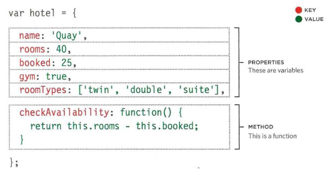

# Tables

## What's a Table?

**The Table element. The <table> HTML element represents tabular data — that is, information presented in a two-dimensional table comprised of rows and columns of cells containing data.**

## basic Table Structure

***

## Table headings

***

# Summary

+ The `<table>` element is used to add tables to a web page.
+ A table is drawn out row by row. Each row is created with the `<tr>` element.
+ Inside each row there are a number of cells represented by the `<td>` element (or `<th>` if it is a header).
+ You can make cells of a table span more than one row or column using the rowspan and colspan attributes.
+ For long tables you can split the table into a `<thead>`, `<tbody>`, and `<tfoot>`.

***

# Functions, Methods, and Objects

# What is an object?

**objects group together a set of variables and functions to create a model of a something you would recognize from the real world. In an object, variables and functions take on new names.**

**Example:**

