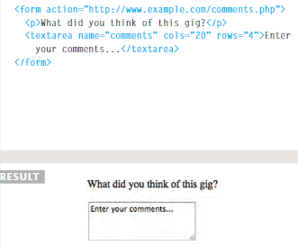

# Forms

**Form Controls**

***

+ text input

**The `<input>` element is used to create several different form controls. The value of the type attribute determines what kind of input they will be creating.**

***

+ password input

**When the type attribute has a value of password it creates a text box that acts just like a single-line text input, except the characters are blocked out. They are hidden in this way so that if someone is looking over the user's shoulder, they cannot see sensitive data such as passwords.**

***

+ text area

**The `<textarea>` element is used to create a multiline text input. Unlike other input elements this is not an empty element. It should therefore have an opening and a closing tag.**

***

+ button & hidden Controls

**The `<button>` element was introduced to allow users more control over how their buttons appear, and to allow other elements to appear inside the button.**

***

Summary

+ Whenever you want to collect information from visitors you will need a form, which lives inside a `<form>` element.
+ Information from a form is sent in name/value pairs.
+ Each form control is given a name, and the text the user types in or the values of the options they select are sent to the server.
+ HTML5 introduces new form elements which make it easier for visitors to fill in forms.

***

# Lists, Tables & Forms

- bullet Point styles List

> `list-style-type`

**The list-style-type property allows you to control the shape or style of a bullet point (also known as a marker).**

- images For Bullets

> `list-style-image`

**You can specify an image to act as a bullet point using the list-style-image property.**

**The value starts with the letters url and is followed by a pair of parentheses. Inside the parentheses, the path to the image is given inside double quotes.**

***

- Positioning the marker

> `list-style-position`

**Lists are indented into the page by default and the list-style-position property indicates whether the marker should appear on the inside or the outside of the box containing the main points.**

***

Summary

* In addition to the CSS properties covered in other chapters which work with the contents of all elements, there are several others that are specifically used to control the appearance of lists, tables, and forms.
* List markers can be given different appearances using the list-style-type and list-style image properties.
* Table cells can have different borders and spacing in different browsers, but there are properties you can use to control them and make them more consistent. 
* Forms are easier to use if the form controls are vertically aligned using CSS.
* Forms benefit from styles that make them feel more interactive.

***

# Events

**Events are a part of the Document Object Model (DOM) Level 3 and every HTML element contains a set of events which can trigger JavaScript Code.**

+ Traditional DOM Event Handlers

**All modern browsers understand this way of creating an event handler, but you can only attach one function to each event handler.**

+ Event listeners

**Event listeners are a more recent approach to handling events. They can deal with more than one function at a time but they are not supported in older browsers.**

***

Summary

+ Events are the browser's way of indicating when something has happened (such as when a page has finished loading or a button has been clicked). 
+ Binding is the process of stating which event you are waiting to happen, and which element you are waiting for that event to happen upon. 
+ When an event occurs on an element, it can trigger a JavaScript function. When this function then changes the web page in some way, it feels interactive because it has responded to the user. 
+ You can use event delegation to monitor for events that happen on all of the children of an element. 
+ The most commonly used events are W3C DOM events, although there are others in  the HTMLS specification as well as browser specific events. 