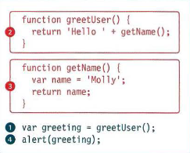

# Error Handling & Debugging

+ ORDER OF EXECUTION 

**To find the source of an error, it helps to know how scripts are processed. The order in which statements are executed can be complex; some tasks cannot complete until another statement or function has been run:**

***

## Code Debugging

**Programming code might contain syntax errors, or logical errors. Many of these errors are difficult to diagnose. Often, when programming code contains errors, nothing will happen. There are no error messages, and you will get no indications where to search for errors. Searching for (and fixing) errors in programming code is called code debugging.**

## JavaScript Debuggers

**Debugging is not easy. But fortunately, all modern browsers have a built-in JavaScript debugger. Built-in debuggers can be turned on and off, forcing errors to be reported to the user. With a debugger, you can also set breakpoints (places where code execution can be stopped), and examine variables while the code is executing.**

**The `console.log()` Method**

**If your browser supports debugging, you can use console.log() to display JavaScript values in the debugger window:**

**Example:**

`a = 5;`

`b = 6;`

`c = a + b;`

`console.log(c);`

***

## The debugger Keyword

**The debugger keyword stops the execution of JavaScript, and calls (if available) the debugging function. This has the same function as setting a breakpoint in the debugger. If no debugging is available, the debugger statement has no effect. With the debugger turned on, this code will stop executing before it executes the third line.**

**Example:**

> **in html**

`

`

***

> **in javascript**

`let x = 15 * 5;`

`debugger;`

`document.getElementById("demo").innerHTML = x;`

