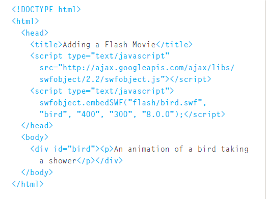

# Images

* Controlling size of images in CSS

**Controlling the size and alignment of your images using CSS keeps rules that affect the presentation of your page in the CSS and out of the HTML markup.**

***

* Aligning images in CSS

**The float property can be used to move an element to the left or the right of its containing block, allowing text to flow around it.**

***

* Adding background images

**The background-image property allows you to place an image behind any HTML element. This could be the entire page or just part of the page. By default, a background image will repeat to fill the entire box.**

**The path to the image follows the letters url, and it is put inside parentheses and quotes.**

***

Summary

* You can specify the dimensions of images using CSS. This is very helpful when you use the same sized images on several pages of your site.
* Images can be aligned both horizontally and vertically using CSS.
*  You can use a background image behind the box  created by any element on a page.
* Background images can appear just once or be repeated across the background of the box.
* You can create image rollover effects by moving the background position of an image.
* To reduce the number of images your browser has to load, you can create image sprites.

***

# Flash

**Flash is a very popular technology used to add animations, video, and audio to websites. This chapter begins by looking at how to use it in your web pages.**

***

* Adding a Flash Movie to Your Web Page

**The most popular way of adding Flash into a web page is using JavaScript. There are several scripts that allow you to do this without an in-depth understanding of the JavaScript language.**

***

Summary

* Flash allows you to add animations, video and audio to the web.
* Flash is not supported on iPhone or iPad. 
* HTML5 introduces new `<video>` and `<audio>` elements for adding video and audio to web pages, but these are only supported in the latest browsers.
* Browsers that support the HTML5 elements do not all support the same video and audio formats, so you need to supply your files in different formats to ensure that everyone can see/hear them.