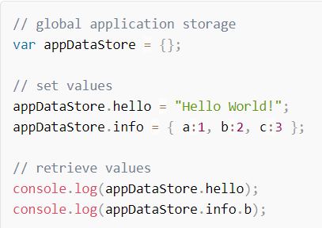
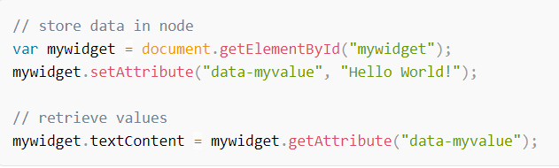
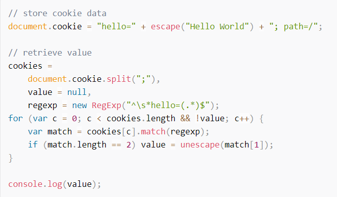

# Local Storage

* Why Store Data on the Client?

**The main reason is practicality. JavaScript code running on the browser does not necessarily need to send all information to the server. There are several use cases:**

* You want to increase performance. You can cache data client-side so it can be retrieved without additional server requests.

* You have a significant quantity of client-side-only data, e.g. HTML strings or widget configuration settings.

* You want you make your application work off-line.

***

* JavaScript Variables (Past, Present and Future)

**The simplest choice is JavaScript variables. It may be practical to create a single global variable to store application data, e.g.**

**It’s also possible to store values in the page DOM as node attributes or properties. This can be useful for widget-specific values, but it’s slower and riskier than JavaScript variables; future browsers or other libraries may interpret your data in unexpected ways.**

## The advantages of JavaScript variables:

* the fastest and simplest solution
* no need to serialize or de-serialize data
* ideal for single-page applications

## The disadvantages:

* very fragile — linking elsewhere, refreshing or closing the tab will wipe all data
* global variables can be overwritten and analyzed by third-party scripts.

***

* Cookies (Past, Present and Future)

**Cookies are domain-specific chunks of text data. They sound tasty, but cookie handling is awkward in JavaScript since the basic `document.cookie` string must be parsed, e.g.**

## The advantages of cookies:

* a reliable method of retaining state between the client and server
* by setting an expiry date, cookie data will persist beyond page refreshes and tab closing
* cookies are supported in all modern browsers

## The disadvantages:

* clunky JavaScript implementation — you will need a cookie-handling library
* values are strings only — other data must be serialized using methods such as `JSON.stringify` and `JSON.parse`
* cookie storage space is limited — do not depend on having more than 20 cookies of 4KB each
* cookies can be deleted or blocked
* cookies were unfairly labeled as a threat to internet privacy; you may need to comply with bizarre regional rules and regulations.

**The flip-side of cookie client/server sharing causes the biggest technical issue. Cookie data is sent in the HTTP header of every request and response. It’s therefore appended to every HTML page, image, CSS file, JavaScript file, Ajax call, etc. If you had 50Kb of cookie data and downloaded ten 1KB images, it would result in one megabyte of additional network traffic.**