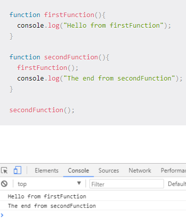

# In memory storage

## What is a ‘call’?

**a call stack is a data structure that uses the Last In, First Out (LIFO) principle to temporarily store and manage function invocation (call).**

***

## How many ‘calls’ can happen at once?

**once a time**

***

## What does LIFO mean?

**It means that the last function that gets pushed into the stack is the first to be pop out, when the function returns.**

***

## Draw an example of a call stack and the functions that would need to be invoked to generate that call stack?

***

## What causes a Stack Overflow?

**A stack overflow `occurs when there is a recursive function (a function that calls itself) without an exit point.` The browser (hosting environment) has a maximum stack call that it can accomodate before throwing a stack error.**

***

## What is a ‘refrence error’?

**thrown when a code attempts to reference a non-existing variable.**

***

## What is a ‘syntax error’?

**this occurs when you have something that cannot be parsed in terms of syntax.**

***

## What is a ‘range error’?

**manipulate an object with some kind of length and give it an invalid length and this kind of errors will show up.**

***

## What is a ‘tyep error’?

**this types of errors show up when the types (number, string and so on) you are trying to use or access are incompatible, like accessing a property in an undefined type of variable.**

***

## What is a breakpoint?

**At each breakpoint, JavaScript will stop executing, and let you examine JavaScript values. After examining values, you can resume the execution of code (typically with a play button).**

***

## What does the word ‘debugger’ do in your code?

**Debuggers allow users to halt the execution of the program, examine the values of variables, step execution of the program line by line, and set breakpoints on lines or specific functions that, when hit, will halt execution of the program at that spot.**
